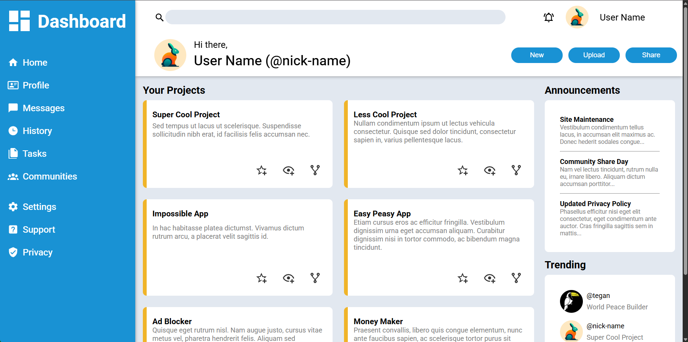

# Admin Dashboard UI

**[View Live Demo](https://merlindeadleft.github.io/odin-admin-dashboard/)**

 

 

A responsive admin dashboard interface built entirely with pure HTML and CSS. This project demonstrates proficiency in modern web layout techniques, specifically focusing on complex CSS Grids and Flexbox. 
Built as part of [The Odin Project](https://www.theodinproject.com/) curriculum to solidify frontend styling and UI/UX implementation without the use of external CSS frameworks. (Seventh project, second on the node path [Link to project instructions](https://www.theodinproject.com/lessons/node-path-intermediate-html-and-css-admin-dashboard))

## Technologies Used

- HTML5 (semantic markup)
- CSS3 (CSS Grids, Flexbox, Custom Variables)
- Responsive Web Design principles

## Attributions

Icons used from [Pictogrammers'](https://pictogrammers.com/) Material Design Icons library.

<a href="https://unsplash.com/illustrations/a-monkey-hanging-upside-down-in-a-jungle-TxeVwOazfs8?utm_source=unsplash&utm_medium=referral&utm_content=creditCopyText">Illustration</a> by <a href="https://unsplash.com/@fadhilsanad/illustrations?utm_source=unsplash&utm_medium=referral&utm_content=creditCopyText">Fast Ink</a> on <a href="https://unsplash.com/illustrations?utm_source=unsplash&utm_medium=referral&utm_content=creditCopyText">Unsplash</a>

<a href="https://unsplash.com/illustrations/a-simple-white-toucan-against-a-black-background-aDCkA853XPw?utm_source=unsplash&utm_medium=referral&utm_content=creditCopyText">Illustration</a> by <a href="https://unsplash.com/@deep_erudite/illustrations?utm_source=unsplash&utm_medium=referral&utm_content=creditCopyText">Deep</a> on <a href="https://unsplash.com/illustrations?utm_source=unsplash&utm_medium=referral&utm_content=creditCopyText">Unsplash</a>

<a href="https://unsplash.com/illustrations/a-colorful-modern-rabbit-logo-design-2XIKIQ8cXkk?utm_source=unsplash&utm_medium=referral&utm_content=creditCopyText">Illustration</a> by <a href="https://unsplash.com/@deep_erudite/illustrations?utm_source=unsplash&utm_medium=referral&utm_content=creditCopyText">Deep</a> on <a href="https://unsplash.com/illustrations?utm_source=unsplash&utm_medium=referral&utm_content=creditCopyText">Unsplash</a>

<a href="https://unsplash.com/illustrations/a-simple-adorable-cartoon-cat-uWaV9FqbIdw?utm_source=unsplash&utm_medium=referral&utm_content=creditCopyText">Illustration</a> by <a href="https://unsplash.com/@kenyaam/illustrations?utm_source=unsplash&utm_medium=referral&utm_content=creditCopyText">Kenya Aguirre</a> on <a href="https://unsplash.com/illustrations?utm_source=unsplash&utm_medium=referral&utm_content=creditCopyText">Unsplash</a>